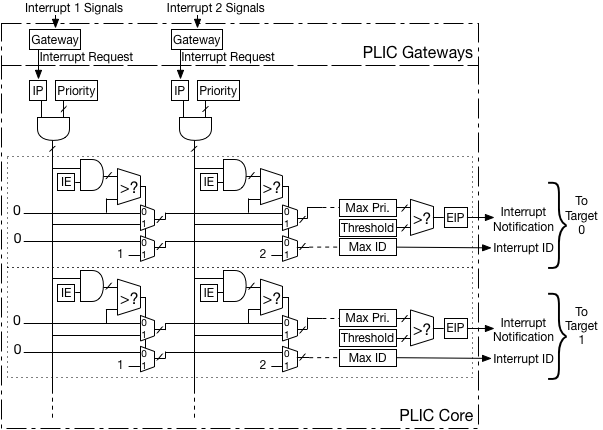
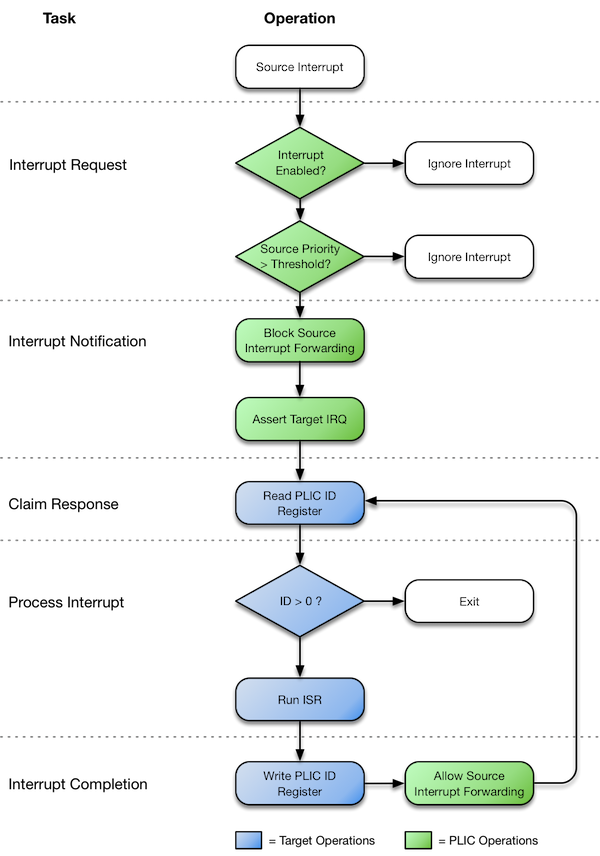
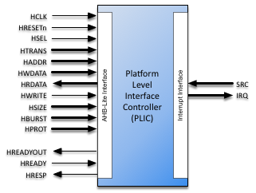
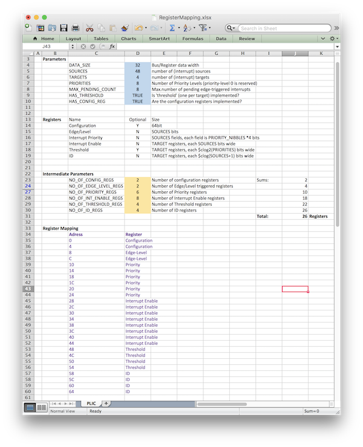

# AHB-Lite Platform-Level Interrupt Controller (PLIC) Datasheet

## Contents

-   [Product Brief](#product-brief)
-   [Specifications](#specifications)
-   [Configurations](#configurations)
-   [Interfaces](#interfaces)
-   [Resources](#resources)
-   [References](#references)
-   [Revision History](#revision-history)

## Product Brief

The Roa Logic AHB-Lite PLIC (Platform Level Interrupt Controller) IP is a fully parameterised soft IP implementing the Interrupt Controller defined in the *[RISC-V Privileged v1.9.1 specification](https://github.com/riscv/riscv-isa-manual/blob/master/release/riscv-privileged-v1.9.1.pdf)*[1].

The IP features an AHB-Lite Slave interface, fully compliant with the *[AMBA 3 AHB-Lite v1.0](https://www.arm.com/products/system-ip/amba-specifications)* specifications.

Bus address and data widths as well as the number of Interrupt Sources and Targets supported are configurable via compile-time parameters. The controller further supports user configurable priority levels and pending events, in addition to interrupt masking via programmable priority thresholds.

### Features

-   AHB-Lite Interface with parameterised address and data width

-   User defined number of Interrupt Sources and Targets

-   User defined priority level per Interrupt Source

-   Interrupt masking per target via Priority Threshold support

-   User defined Interrupt Pending queue depth per source

## Specifications

### Overview

The AHB-Lite PLIC IP core is a fully parameterised Platform-Level Interrupt Controller, featuring a single AHB-Lite Slave interface and support for a user-defined number of both Interrupt Sources and Targets.

The purpose of the PLIC core is to connect multiple interrupt sources to one or more interrupt targets. The core supports a programmable number of simultaneous pending interrupt requests per source and individual routing of those interrupt requests to each target.

Per the [RISC-V Privileged Architecture Instruction Set specification (v1.9.1)](https://github.com/riscv/riscv-isa-manual/blob/master/release/riscv-privileged-v1.9.1.pdf), the core performs full interrupt prioritisation of each interrupt source; each may be assigned a separate priority and enabled per target via a matrix of interrupt enable bits. Further, an optional priority threshold per target may be defined to mask lower priority interrupts.

To reduce latency, the PLIC core presents all asserted interrupts to the target in priority order, queuing them so that a software interrupt handler can service all pending interrupts without the need to restore the interrupted context.

For illustration, a simplified example system using the PLIC core is shown below:

### PLIC Operation

As stated in the [RISC-V Privileged Architecture Instruction Set specification (v1.9.1)](https://github.com/riscv/riscv-isa-manual/blob/master/release/riscv-privileged-v1.9.1.pdf):

> PLIC connects global *interrupt sources*, which are usually I/O devices, to *interrupt targets*, which are usually *hart contexts*. The PLIC contains multiple *interrupt gateways*, one per interrupt source, together with a *PLIC core* that performs interrupt prioritization and routing. Global interrupts are sent from their source to an *interrupt gateway* that processes the interrupt signal from each source and sends a single *interrupt request* to the PLIC core, which latches these in the core interrupt pending bits (IP). Each interrupt source is assigned a separate priority. The PLIC core contains a matrix of interrupt enable (IE) bits to select the interrupts that are enabled for each target. The PLIC core forwards an *interrupt notification* to one or more targets if the targets have any pending interrupts enabled, and the priority of the pending interrupts exceeds a per-target threshold. When the target takes the external interrupt, it sends an *interrupt claim* request to retrieve the identifier of the highest-priority global interrupt source pending for that target from the PLIC core, which then clears the corresponding interrupt source pending bit. After the target has serviced the interrupt, it sends the associated interrupt gateway an *interrupt completion* message and the interrupt gateway can now forward another interrupt request for the same source to the PLIC.

The figure above provides an overview of PLIC operation, showing the first two of potentially many interrupt sources, and the first two of potentially many interrupt targets.

### Interrupt Handling Handshake

#### Overview

The following figure shows the logical flow of the Interrupt Handling Handshake as implemented byt the Roa Logic PLIC core. The following sections describe the stages depicted: Interrupt Request, Interrupt Notification, Interrupt Claim Response, Processing the Interrupt and Interrupt Completion.

Prior to operation, the PLIC system must be defined and configured as follows:

-   Each source must be assigned an Interrupt Identifier (`ID`) - a unique unsigned integer. This identifier will determine interrupt priority when 2 or more interrupts with the same priority level are asserted; The *lower* the `ID` assigned to the source, the *greater* the interrupt priority

-   A matrix of Interrupt Enable vectors - one IE register per target - must be set to determine which target processes the interrupts from which source.

-   Each Interrupt Source attached to the PLIC assigned a Priority Level - an unsigned integer value - that determines the relative priority of the interrupt source. Larger values have higher priority.

-   Optionally, a Priority Threshold per target set to mask lower priority interrupts such that interrupts will only be presented to a target if the assigned Priority Level is greater than the Priority Threshold.

#### Interrupt Request Stage

A source asserts an interrupt request to the PLIC. The PLIC validates the request by first checking if an interrupt enable bit is set for each target and if the priority of the interrupt source exceeds any defined Interrupt Priority Threshold. If these conditions do not hold, the Interrupt Request is deemed invalid and stalled pending updates to the interrupt enable and/or priority threshold bits.

The PLIC also determines if a previous interrupt request has been made by the same source. If an interrupt is defined as level triggered and has already been asserted but not yet serviced, the request is ignored. If an interrupt is defined as edge triggered and has already been asserted but not yet serviced, the request is queued by incrementing its Interrupt Pending counter. The depth of this counter is parameterised.

If the request is deemed valid the request is forwarded to the appropriate target. In the case of queued edge-triggered requests, the interrupt pending counter is decremented by one immediately upon claim of the interrupt by the target.

#### Interrupt Notification Stage

A target is notified of an interrupt request by asserting the IRQ output for that target. The PLIC blocks forwarding any further requests from the interrupt source until the current request is serviced.

On each clock cycle the ID register is loaded with the unique identifier of the highest priority interrupt to be processed. This ensures that the Interrupt Service Routine always reads the highest pending interrupt request.

#### Claim Response Stage

A target makes an interrupt claim response by reading the ID register, which also notifies the target of the interrupt source to service. The PLIC de-asserts the IRQ output for the target in response to the claim. unless another, lower priority, interrupt is still pending.

#### Interrupt Handler Stage

If the ID read is greater than zero, the target services the identified interrupt source. If the ID read is zero, this indicates no outstanding pending interrupts remain and the handler may terminate.

#### Interrupt Completion Stage

Once an interrupt has been serviced, completion is signalled to the PLIC by writing to the ID register. The act of writing to the register is the completion notification; the value written is irrelevant.

On receiving the completion notification the PLIC will again allow interrupts to be forwarded from the corresponding source.

The Interrupt Handler may then exit, however it is possible a new interrupt request may have been asserted while the handler was running. To reduce latency the handler may instead determine if a new interrupt has been received and if so again claim the interrupt (See earlier). In this way the interrupt handler can service all interrupts without the need to restore the interrupted context.

## Configurations

### Core Parameters

The size and implementation style of the PLIC module is defined via HDL parameters as specified below:

| **Parameter**         | **Type** | **Default** | **Description**              |
|:----------------------|:--------:|:-----------:|:-----------------------------|
| *AHB Interface:*      |          |             |                              |
| `HADDR_SIZE`          |  Integer |      32     | Width of AHB Address Bus     |
| `HDATA_SIZE`          |  Integer |      32     | Width of AHB Data Buses      |
|                       |          |             |                              |
| *PLIC Configuration:* |          |             |                              |
| `SOURCES`             |  Integer |      16     | Number of Interrupt Sources  |
| `TARGETS`             |  Integer |      4      | Number of Interrupt Targets  |
| `PRIORITIES`          |  Integer |      8      | Number of Priority Levels    |
| `MAX_PENDING_COUNT`   |  Integer |      8      | Max number of pending events |
| `HAS_THRESHOLD`       |  Integer |      1      | Is Threshold Implemented     |
| `HAS_CONFIG_REG`      |  Integer |      1      | Is Config Reg. Implemented   |

### AHB Interface Parameters

#### HADDR\_SIZE

The `HADDR_SIZE` parameter specifies the address bus size to connect to the AHB-Lite based host. Valid values are 32 and 64. The default value is 32.

#### HDATA\_SIZE

The `HDATA_SIZE` parameter specifies the data bus size to connect to the AHB-Lite based host. Valid values are 32 and 64. The default value is 32

The `SOURCES` parameter defines the number of individual interrupt sources supported by the PLIC IP. The default value is 16. The minimum value is 1.

The `TARGETS` parameter defines the number of targets supported by the PLIC IP. The default value is 4. The minimum value is 1.

### PLIC Interface Parameters

#### PRIORITIES

The PLIC IP supports prioritisation of individual interrupt sources. The `PRIORITIES` parameter defines the number of priority levels supported by the PLIC IP. The default value is 8. The minimum value is 1.

#### MAX\_PENDING\_COUNT

An interrupt source may generate multiple edge-triggered interrupts before being fully serviced by the target. To support this the PLIC is able to queue these requests up to a user-defined limit per interrupt source. This limit is defined by the parameter `MAX_PENDING_COUNT`.

If the number of interrupts generated by a source exceeds the value of `MAX_PENDING_COUNT`, those additional interrupts are silently ignored.

The default value of `MAX_PENDING_COUNT` is 8. The minimum value is 0.

#### HAS\_THRESHOLD

The PLIC module supports interrupt thresholds – the masking of individual interrupt sources based on their priority level. The `HAS_THRESHOLD` parameter defines if this capability is enabled.

The default value is enabled (‘1’). To disable, this parameter should be set to ‘0’.

#### HAS\_CONFIG\_REG

The PLIC module supports an optional Configuration Register, which is documented in section 0. The `HAS_CONFIG_REG` parameter defines if this capability is enabled.

The default value is enabled (‘1’). To disable, this parameter should be set to ‘0’.

## Interfaces

### AHB-Lite Interface

The AHB-Lite interface is a regular AHB-Lite slave port. All signals are supported. See the *[AMBA 3 AHB-Lite Specification](https://www.arm.com/products/system-ip/amba-specifications)* for a complete description of the signals.

|   **Port**  |   **Size**   | **Direction** | **Description**               |
|:-----------:|:------------:|:-------------:|:------------------------------|
|  `HRESETn`  |       1      |     Input     | Asynchronous active low reset |
|    `HCLK`   |       1      |     Input     | Clock Input                   |
|    `HSEL`   |       1      |     Input     | Bus Select                    |
|   `HTRANS`  |       2      |     Input     | Transfer Type                 |
|   `HADDR`   | `HADDR_SIZE` |     Input     | Address Bus                   |
|   `HWDATA`  | `HDATA_SIZE` |     Input     | Write Data Bus                |
|   `HRDATA`  | `HDATA_SIZE` |     Output    | Read Data Bus                 |
|   `HWRITE`  |       1      |     Input     | Write Select                  |
|   `HSIZE`   |       3      |     Input     | Transfer Size                 |
|   `HBURST`  |       3      |     Input     | Transfer Burst Size           |
|   `HPROT`   |       4      |     Input     | Transfer Protection Level     |
| `HREADYOUT` |       1      |     Output    | Transfer Ready Output         |
|   `HREADY`  |       1      |     Input     | Transfer Ready Input          |
|   `HRESP`   |       1      |     Output    | Transfer Response             |

#### HRESETn

When the active low asynchronous `HRESETn` input is asserted (‘0’), the interface is put into its initial reset state.

#### HCLK

`HCLK` is the interface system clock. All internal logic for the AHB-Lite interface operates at the rising edge of this system clock and AHB bus timings are related to the rising edge of `HCLK`.

#### HSEL

The AHB-Lite interface only responds to other signals on its bus – with the exception of the global asynchronous reset signal `HRESETn` – when `HSEL` is asserted (‘1’). When `HSEL` is negated (‘0’) the interface considers the bus `IDLE`.

#### HTRANS

HTRANS indicates the type of the current transfer as shown in Table \[tab:HTRANS\]

| **`HTRANS`** | **Type** | **Description**                                                                          |
|:------------:|:--------:|:-----------------------------------------------------------------------------------------|
|     `00`     |  `IDLE`  | No transfer required                                                                     |
|     `01`     |  `BUSY`  | Connected master is not ready to accept data, but intents to continue the current burst. |
|     `10`     | `NONSEQ` | First transfer of a burst or a single transfer                                           |
|     `11`     |   `SEQ`  | Remaining transfers of a burst                                                           |

#### HADDR

`HADDR` is the address bus. Its size is determined by the `HADDR_SIZE` parameter and is driven to the connected peripheral.

#### HWDATA

`HWDATA` is the write data bus. Its size is determined by the `HDATA_SIZE` parameter and is driven to the connected peripheral.

#### HRDATA

`HRDATA` is the read data bus. Its size is determined by the `HDATA_SIZE` parameter and is sourced by the connected peripheral.

#### HWRITE

`HWRITE` is the read/write signal. `HWRITE` asserted (‘1’) indicates a write transfer.

#### HSIZE

`HSIZE` indicates the size of the current transfer as shown in table \[tab:HSIZE\]:

| **`HSIZE`** | **Size** | **Description** |
|:-----------:|:--------:|:----------------|
|    `000`    |   8 bit  | Byte            |
|    `001`    |  16 bit  | Half Word       |
|    `010`    |  32 bit  | Word            |
|    `011`    |  64 bits | Double Word     |
|    `100`    |  128 bit |                 |
|    `101`    |  256 bit |                 |
|    `110`    |  512 bit |                 |
|    `111`    | 1024 bit |                 |

#### HBURST

HBURST indicates the transaction burst type – a single transfer or part of a burst.

| **`HBURST`** | **Type** | **Description**              |
|:------------:|:--------:|:-----------------------------|
|     `000`    | `SINGLE` | Single access                |
|     `001`    |  `INCR`  | Continuous incremental burst |
|     `010`    |  `WRAP4` | 4-beat wrapping burst        |
|     `011`    |  `INCR4` | 4-beat incrementing burst    |
|     `100`    |  `WRAP8` | 8-beat wrapping burst        |
|     `101`    |  `INCR8` | 8-beat incrementing burst    |
|     `110`    | `WRAP16` | 16-beat wrapping burst       |
|     `111`    | `INCR16` | 16-beat incrementing burst   |

#### HPROT

The `HPROT` signals provide additional information about the bus transfer and are intended to implement a level of protection.

| **Bit\#** | **Value** | **Description**                |
|:---------:|:---------:|:-------------------------------|
|     3     |     1     | Cacheable region addressed     |
|           |     0     | Non-cacheable region addressed |
|     2     |     1     | Bufferable                     |
|           |     0     | Non-bufferable                 |
|     1     |     1     | Privileged Access              |
|           |     0     | User Access                    |
|     0     |     1     | Data Access                    |
|           |     0     | Opcode fetch                   |

#### HREADYOUT

`HREADYOUT` indicates that the current transfer has finished. Note, for the AHB-Lite PLIC this signal is constantly asserted as the core is always ready for data access.

#### HREADY

`HREADY` indicates whether or not the addressed peripheral is ready to transfer data. When `HREADY` is negated (‘0’) the peripheral is not ready, forcing wait states. When `HREADY` is asserted (‘1’) the peripheral is ready and the transfer completed.

#### HRESP

`HRESP` is the instruction transfer response and indicates OKAY (‘0’) or ERROR (‘1’).

### Interrupt Interface

The PLIC provides a single input bus to which all interrupt sources must connect, one bit of the bus per source. A single output bus similarly connects to all interrupt targets, one bit per target. The width of each of these interface buses is specified as a core parameter.

| **Port** |  **Size** | **Direction** | **Description**    |
|:---------|:---------:|:-------------:|:-------------------|
| `SRC`    | `SOURCES` |     Input     | Interrupt Sources  |
| `IRQ`    | `TARGETS` |     Output    | Interrupt Requests |

#### SRC

Interrupt sources connect to the `SRC[SOURCES-1..0]` input of the PLIC module. The width of this interface is defined by the `SOURCES` parameter.

#### IRQ

Interrupt targets are sourced by the `IRQ[TARGETS-1..0]` output of the PLIC module. The width of this interface is defined by the `TARGETS` parameter.

### Register Interface

The operation and run-time configuration of the PLIC is managed via a memory mapped register interface consisting of the following registers:

| **Register** | **Registers** |        **Width (bits)**        | **Mode** | **Function**                                                  |
|:------------:|:-------------:|:------------------------------:|:--------:|:--------------------------------------------------------------|
|   `CONFIG`   |       1       |               64               |    RO    | Configuration                                                 |
|     `EL`     |       1       |            `SOURCES`           |    RW    | Edge/Level Trigger                                            |
|     `IE`     |   `TARGETS`   |            `SOURCES`           |    RW    | Interrupt Enable                                              |
|     `ID`     |   `TARGETS`   |   clog2(`SOURCES`)  |    RW    | ID of Highest priority IRQ, Int. Claim (R), Int. Complete (W) |
|  `PRIORITY`  |   `SOURCES`   | clog2(`PRIORITIES`) |    RW    | Priority Level                                                |
|  `THRESHOLD` |   `TARGETS`   | clog2(`PRIORITIES`) |    RW    | Priority Threshold                                            |

Note: clog2() refers to the System Verilog function by the same name, defined as:

> *The system function $clog2 shall return the ceiling of the log base 2 of the argument (the log rounded up to an integer value). The argument can be an integer or an arbitrary sized vector value. The argument shall be treated as an unsigned value, and an argument value of 0 shall produce a result of 0.*

#### Register Descriptions

The purpose and functionality of each register of the interface is documented in the following sections:

##### CONFIG

The `CONFIG` register is a Read-Only register that enables a software routine to determine the hardware configuration of the PLIC module.

When enabled via the `HAS_CONFIG_REG` hardware parameter, the `CONFIG` register returns a 64 bit value constructed as follows:

The values, `HAS_THRESHOLD`, `PRIORITIES`, `TARGETS` and `SOURCES` correspond to the hardware parameters documented in the section \[Core Parameters\].

The `CONFIG` register is always 64 bits. For 32 bit implementations this means 2 physical registers are required, 1 each for the upper and lower word. For 64 bit implementations a single register will be implemented.

##### EL

The `EL` Read/Write register defines if an interrupt source is Edge or Level Triggered. The number of interrupt sources, as defined by the `SOURCES` parameter, determines the width of the `EL` register. One bit within the register corresponds to an interrupt source, where a logic high (‘1’) defines a rising-edge triggered interrupt and a logic low (‘0’) defines a level triggered interrupt. These bits will be packed into the minimum number of registers.

The physical number of registers implemented can be calculated as follows:

> `No. of Registers = ROUNDUP(SOURCES/HDATA_SIZE)`

Example: For a 32 bit system supporting 48 interrupt sources

         No. of Registers = ROUNDUP(SOURCES/HDATA_SIZE)
                          = ROUNDUP(48/32)
                          = ROUNDUP(1.5)
                          = 2

##### IE\[\]

A matrix of `IE[]` Read/Write registers define if an interrupt source is enabled or disabled for a specific target. When disabled, any interrupts generated by the source will be ignored by the PLIC.

The number of targets determines the number of `IE[]` registers. The number of interrupt sources, as defined by the `SOURCES` parameter, determines the width of each `IE[]` register.

One bit within the register corresponds to an individual interrupt source, where a logic high (‘1’) defines an interrupt source as enabled and a logic low (‘0’) as disabled. These bits will be packed into the fewest registers possible and the resulting number of registers calculated as follows:

> `No. of Registers = ROUNDUP(SOURCES/HDATA_SIZE)*TARGETS`

Example: For a 32 bit system supporting 48 interrupt sources and 4 targets

         No. of Registers = ROUNDUP(SOURCES/HDATA_SIZE)*TARGETS
                          = ROUNDUP(48/32)*4
                          = ROUNDUP(1.5)*4
                          = 2*4
                          = 8

##### ID\[\]

The `ID[]` Read/Write register identifies to each target the ID of the highest priority pending interrupt request.

> `No. of Registers = TARGETS`

This register indicates to the target which of potentially multiple pending interrupts should be serviced rather than relying on this being resolved by the software Interrupt Service Routine.

When a target reads this register, this also indicates the target has claimed the interrupt for the defined source and will service the interrupt source.

A target then writes to this register to indicate completion of servicing the interrupt source. It is the action of writing to this register which generates the interrupt completion notification – the value written will be ignored. Instead the register continues to identify the highest priority interrupt source to be serviced.

##### PRIORITY\[\]

The `PRIORITY[]` Read/Write registers define the priority level of each interrupt source. Interrupt priority increases with larger values of `PRIORITY`.

There is one `PRIORITY[]` register per interrupt source as defined by the `SOURCES` parameter, identified as `PRIORITY[SOURCES-1:0]`. The width of each register is derived from the number of priority levels as defined by the `PRIORITIES` parameter.

Interrupt priority increases with larger values of `PRIORITY`.

##### THRESHOLD\[\]

Each target may be assigned a priority threshold via the `THRESHOLD[]` registers. Only pending interrupts that have a priority strictly greater than the threshold will cause an interrupt notification to be sent to the target. A `THRESHOLD[]` value of 0 means that no interrupts will be masked.

#### Register Address Mapping

The PLIC supports a wide variety of options and unlimited user-definable number of both interrupt sources and targets. A regsiter interface is used to configure and control the PLIC. This interface is specific to the implementation.

To ease the development of PLIC based systems, the Roa Logic PLIC implements a dynamic register interface, based on the IP’s parameters. The PLIC packs multiple bit-fields into registers where feasible to minimise the required address space.

The following sections describe the calculations performed during generation of the dynamic register interface so that the user may determine the registers available and the memory mapping of those registers for a given implementation.

A spreadsheet in Microsoft Excel format is available to perform these calculations based on user-defined parameters to show the registers and memory mapping. Further, simulation of the PLIC will also shows the registers and memory mapping in the simulator output log.

##### Itemising Register Requirements

The section *Register Interface* provides a summary of the registers required to control and configure the PLIC. The following sections provide more details of those requirements.

###### CONFIG Register:

 
The `CONFIG` register is always 64 bits. For 32 bit implementations this means 2 physical registers are required, 1 each for the upper and lower word. For 64 bit implementations a single register will be implemented.

###### EL Registers:

 
Each interrupt source requires a single bit in the `EL` register to define if the source is level or edge triggered. These bits will be packed into the minimum number of registers.

The physical number of registers implemented can be calculated as follows:

> `No. of Registers = ROUNDUP(SOURCES/HDATA_SIZE)`

Example: For a 32 bit system supporting 48 interrupt sources

         No. of Registers = ROUNDUP(SOURCES/HDATA_SIZE)
                          = ROUNDUP(48/32)
                          = ROUNDUP(1.5)
                          = 2

###### IE Registers:

 
Interrupt sources may be enabled or disabled per target requiring single bit per target. These bits will be packed into the fewest registers possible and the resulting number of registers calculated as follows:

> `No. of Registers = ROUNDUP(SOURCES/HDATA_SIZE)*TARGETS`

Example: For a 32 bit system supporting 48 interrupt sources and 4 targets

         No. of Registers = ROUNDUP(SOURCES/HDATA_SIZE)*TARGETS
                          = ROUNDUP(48/32)*4
                          = ROUNDUP(1.5)*4
                          = 2*4
                          = 8

###### ID Registers:

 
The `ID[]` Read/Write register identifies the ID of the highest priority pending interrupt request, with one ID register required per target.

The `ID[]` register also functions as part of the interrupt claim and completion process. A target claims the identified interrupt by the action of reading the register. The target then indicates servicing the interrupt is complete by the action of writing to the regsiter. Any value may be written to indicate completion.

> `No. of Registers = TARGETS`

###### PRIORITY Registers:

 
Each interrupt source may be assigned a priority, which is defined as a positive integer value and the higher the value the greater the priority. The PLIC parameter `PRIORITIES` defines the number of priority levels for a specific implementation, which then allows a source to be assigned a priority between 1 and `PRIORITIES`.

These priority levels are packed into `HDATA_SIZE` bit registers, as fields aligned to 4-bit nibble boundaries

> `No. of Registers = ROUNDUP(SOURCES/FPR)`

where:

         FPR = FIELDS_PER_REGISTER
             = HDATA_SIZE/(4*NPP)

         NPP = NIBBLES_PER_PRIORITY
             = ROUNDUP($clog2(PRIORITIES+1)/4)

Example: For a 32 bit system supporting 48 interrupt sources and 8 priority levels

         NPP = NIBBLES_PER_PRIORITY
             = ROUNDUP($clog2(PRIORITIES+1)/4)
             = ROUNDUP($clog2(8+1)/4)
             = ROUNDUP(4/4)
             = 1

         FPR = FIELDS_PER_REGISTER
             = HDATA_SIZE/(4*NPP)
             = 32/(4*1)
             = 8

         No. of Registers = ROUNDUP(SOURCES/FPR)
                          = ROUNDUP(48/8)
                          = 6

Note: clog2() refers to the System Verilog function by the same name and calculates the number of binary bits required to represent a given integer.

###### THRESHOLD Registers

 
Each target may be assigned a priority threshold via the `THRESHOLD[]` registers and therefore the PLIC implements 1 register per threshold.

> `No. of Registers = TARGETS`

Only active interrupts that have a priority strictly greater than the threshold will cause an interrupt notification to be sent to the target. A `THRESHOLD[]` value of 0 means that no interrupts will be masked.

##### Register Address Ordering

The order of the registers in the memory map is defined below.

| **Order** | **Registers**         |
|:---------:|:----------------------|
|     1     | `CONFIG` Register(s)  |
|     2     | `EL` Registers        |
|     3     | `PRIORITY` Registers  |
|     4     | `IE` Registers        |
|     5     | `THRESHOLD` Registers |
|     6     | `ID` Registers        |

Registers are mapped to consecutive addresses based on this order and the number of registers required.

##### Address Map Example

Using the example of a 32 bit system supporting 48 interrupt sources, 4 targets and 8 priority levels as shown below.

| **Parameter** | **Number** |
|:-------------:|:----------:|
| `HDATA_WIDTH` |     32     |
|   `SOURCES`   |     48     |
|   `TARGETS`   |      4     |
|  `PRIORITIES` |      8     |

The resulting number of registers is:

| **Registers** | **Number** |
|:-------------:|:----------:|
|    `CONFIG`   |      2     |
|      `EL`     |      2     |
|   `PRIORITY`  |      6     |
|      `IE`     |      8     |
|  `THRESHOLD`  |      4     |
|      `ID`     |      4     |
|   **Total**   |   **26**   |

These registers will be then mapped as follows per the order defined previously.

| **Reg** | **Parameter** |  **Value** | **Reg** | **Parameter** |  **Value**  |
|:-------:|:-------------:|:----------:|:-------:|:-------------:|:-----------:|
|  **0**  |      0x0      |  `CONFIG`  |  **13** |      0x34     |     `IE`    |
|  **1**  |      0x4      |  `CONFIG`  |  **14** |      0x38     |     `IE`    |
|  **2**  |      0x8      |    `EL`    |  **15** |      0x3C     |     `IE`    |
|  **3**  |      0xC      |    `EL`    |  **16** |      0x40     |     `IE`    |
|  **4**  |      0x10     | `PRIORITY` |  **17** |      0x44     |     `IE`    |
|  **5**  |      0x14     | `PRIORITY` |  **18** |      0x48     | `THRESHOLD` |
|  **6**  |      0x18     | `PRIORITY` |  **19** |      0x4C     | `THRESHOLD` |
|  **7**  |      0x1C     | `PRIORITY` |  **20** |      0x50     | `THRESHOLD` |
|  **8**  |      0x20     | `PRIORITY` |  **21** |      0x54     | `THRESHOLD` |
|  **9**  |      0x24     | `PRIORITY` |  **22** |      0x58     |     `ID`    |
|  **10** |      0x28     |    `IE`    |  **23** |      0x5C     |     `ID`    |
|  **11** |      0x2C     |    `IE`    |  **24** |      0x60     |     `ID`    |
|  **12** |      0x30     |    `IE`    |  **25** |      0x64     |     `ID`    |

**Note:** A Microsoft Excel worksheet is available from the Roa Logic web site showing the same Address Map.

#### Dynamic Register Examples

When simulating the PLIC, the simulator will print a detailed Register Address Mapping showing explicitly how each interrupt source and target maps to the register fields. Below are 2 examples illustrating this capability.

##### Dynamic Register Example 1:

###### Parameter Settings:

| **Parameter** | **Value** | **Parameter**  | **Value** | **Parameter**    | **Value** |
|:--------------|:---------:|:---------------|:---------:|:-----------------|:---------:|
| HDATA\_SIZE   |     32    | SOURCES        |     16    | TARGETS          |     2     |
| PRIORITIES    |     7     | HAS\_THRESHOLD |     1     | HAS\_CONFIG\_REG |     0     |

###### Simulator Output:

    - Configuration Report ---------------------------------------------------
      Sources | Targets | Priority-lvl | Threshold? | Event-Cnt
         16   |    2    |      7       |    YES     |    8
    - Register Map -----------------------------------------------------------
      Address  Function               Mapping
      0x0000   Edge/Level             16'h0, EL[15:0]
      0x0004   Interrupt Priority     1'b0,P[7][2:0],1'b0,P[6][2:0],1'b0,
                                      P[5][2:0],1'b0,P[4][2:0],1'b0,P[3][2:0],
                                      1'b0,P[2][2:0],1'b0,P[1][2:0],1'b0,
                                      P[0][2:0]
      0x0008   Interrupt Priority     1'b0,P[15][2:0],1'b0,P[14][2:0],1'b0,
                                      P[13][2:0],1'b0,P[12][2:0],1'b0,
                                      P[11][2:0],1'b0,P[10][2:0],1'b0,
                                      P[9][2:0],1'b0,P[8][2:0]
      0x000c   Interrupt Enable       16'h0, IE[0][15:0]
      0x0010   Interrupt Enable       16'h0, IE[1][15:0]
      0x0014   Priority Threshold     29'h0, Th[0][2:0]
      0x0018   Priority Threshold     29'h0, Th[1][2:0]
      0x001c   ID                     27'h0, ID[0][4:0]
      0x0020   ID                     27'h0, ID[1][4:0]
    - End Configuration Report -----------------------------------------------

##### Dynamic Register Example 2:

###### Parameter Settings:

| **Parameter** | **Value** | **Parameter**  | **Value** | **Parameter**    | **Value** |
|:--------------|:---------:|:---------------|:---------:|:-----------------|:---------:|
| HDATA\_SIZE   |     64    | SOURCES        |     64    | TARGETS          |     4     |
| PRIORITIES    |     15    | HAS\_THRESHOLD |     1     | HAS\_CONFIG\_REG |     1     |

###### Simulator Output:

    - Configuration Report ---------------------------------------------------
      Sources | Targets | Priority-lvl | Threshold? | Event-Cnt
         64   |    4    |     15       |    YES     |    8
    - Register Map -----------------------------------------------------------
      Address  Function               Mapping
      0x0000   Configuration          15'h0,TH,PRIORITES,TARGETS,SOURCES
      0x0008   Edge/Level             EL[63:0]
      0x0010   Interrupt Priority     P[15][3:0],P[14][3:0],P[13][3:0],
                                      P[12][3:0],P[11][3:0],P[10][3:0],
                                      P[9][3:0],P[8][3:0],P[7][3:0],P[6][3:0],
                                      P[5][3:0],P[4][3:0],P[3][3:0],P[2][3:0],
                                      P[1][3:0],P[0][3:0]
      0x0018   Interrupt Priority     P[31][3:0],P[30][3:0],P[29][3:0],
                                      P[28][3:0],P[27][3:0],P[26][3:0],
                                      P[25][3:0],P[24][3:0],P[23][3:0],
                                      P[22][3:0],P[21][3:0],P[20][3:0],
                                      P[19][3:0],P[18][3:0],P[17][3:0],
                                      P[16][3:0]
      0x0020   Interrupt Priority     P[47][3:0],P[46][3:0],P[45][3:0],
                                      P[44][3:0],P[43][3:0],P[42][3:0],
                                      P[41][3:0],P[40][3:0],P[39][3:0],
                                      P[38][3:0],P[37][3:0],P[36][3:0],
                                      P[35][3:0],P[34][3:0],P[33][3:0],
                                      P[32][3:0]
      0x0028   Interrupt Priority     P[63][3:0],P[62][3:0],P[61][3:0],
                                      P[60][3:0],P[59][3:0],P[58][3:0],
                                      P[57][3:0],P[56][3:0],P[55][3:0],
                                      P[54][3:0],P[53][3:0],P[52][3:0],
                                      P[51][3:0],P[50][3:0],P[49][3:0],
                                      P[48][3:0]
      0x0030   Interrupt Enable       IE[0][63:0]
      0x0038   Interrupt Enable       IE[1][63:0]
      0x0040   Interrupt Enable       IE[2][63:0]
      0x0048   Interrupt Enable       IE[3][63:0]
      0x0050   Priority Threshold     60'h0, Th[0][3:0]
      0x0058   Priority Threshold     60'h0, Th[1][3:0]
      0x0060   Priority Threshold     60'h0, Th[2][3:0]
      0x0068   Priority Threshold     60'h0, Th[3][3:0]
      0x0070   ID                     57'h0, ID[0][6:0]
      0x0078   ID                     57'h0, ID[1][6:0]
      0x0080   ID                     57'h0, ID[2][6:0]
      0x0088   ID                     57'h0, ID[3][6:0]
    - End Configuration Report ---------------------------------------------------

## Resources

Below are some example implementations for various platforms. All implementations are push button, with no effort undertaken to reduce area or improve performance.

| **Platform**    | **DFF** | **Logic Cells/Elements** | **Memory** | **Performance (MHz)** |
|:----------------|:-------:|:------------------------:|:----------:|:---------------------:|
| Altera Cyclone4 |   1234  |         4470 LEs         |      0     |                       |
|                 |         |                          |            |                       |
|                 |         |                          |            |                       |

Note: This table will be updated as more examples are compiled.

## References

The PLIC is designed to be compliant with the following specifications, as licensed under the Creative Commons Attribution 4.0 International License:

> “The [RISC-V Instruction Set Manual, Volume I: User-Level ISA, Document Version 2.2](https://github.com/riscv/riscv-isa-manual/blob/master/release/riscv-spec-v2.2.pdf)", Editors Andrew Waterman and Krste Asanović,RISC-V Foundation, May 2017.

> “The [RISC-VInstruction Set Manual, Volume II: Privileged Architecture, Version 1.9.1](https://github.com/riscv/riscv-isa-manual/blob/master/release/riscv-privileged-v1.9.1.pdf)",Editors Andrew Waterman and Krste Asanović, RISC-V Foundation, November 2016

## Revision History

|   **Date**  | **Rev.** | **Comments**    |
|:-----------:|:--------:|:----------------|
| 13-Oct-2017 |    1.0   | Initial Release |
|             |          |                 |
|             |          |                 |
|             |          |                 |

[1] Full specification details are provided in the References section
