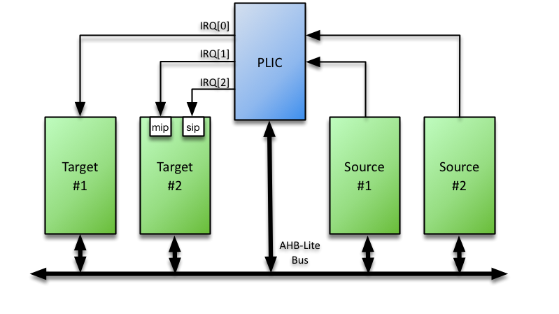

# AHB-Lite Platform-Level Interrupt Controller (PLIC)

## Overview

Fully Parameterized & Programmable Platform Level Interrupt Controller (PLIC) for RISC-V based Processor Systems supporting a user-defined number of interrupt sources and targets, and featuring a single AHB-Lite Slave interface

The core supports a programmable number of simultaneous pending interrupt requests per source and individual routing of those interrupt requests to each target, full interrupt prioritisation of each interrupt source and separate enables per target via a matrix of interrupt enable bits.

To reduce latency, the PLIC core presents all asserted interrupts to the target in priority order, queuing them so that a software interrupt handler can service all pending interrupts without the need to restore the interrupted context.

## Documentation

- [Datasheet](DATASHEET.md)
  - [PDF Format](docs/AHB-Lite_PLIC_Datasheet.pdf)
- [Register Map Worksheet](docs/assets/csv/RegisterMapping.xlsx)

## Features

- AHB-Lite Interface with programmable address and data width
- User defined number of Interrupt Sources & Targets
- User defined priority level per Interrupt Source
- Interrupt masking per target via Priority Threshold support
- User defined Interrupt Pending queue depth per source

## Compatibility

Compliant to the [RISC-V Privilege Level 1.9, 1.9.1, 1.10 specifications](https://github.com/riscv/riscv-isa-manual/tree/master/release)

## Interfaces

- AHB3 Lite
- Dynamic Registers

The PLIC core implements Dynamic Registers, which means the registers and register mapping are automatically generated based on the parameters provided to the core. The core prints the register mapping during simulation (and for some tools during synthesis).

## License

Released under the RoaLogic [BSD License](/LICENSE.md)

## Dependencies
Requires the Roa Logic [AHB3Lite Package](). This is included as a submodule.
After cloning the git repository, perform a `git submodule init` to download the submodule.
