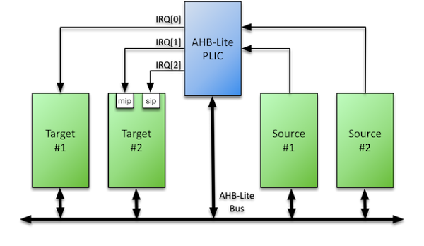

# AHB-Lite PLIC Datasheet

The Roa Logic AHB-Lite PLIC (Platform Level Interrupt Controller) IP is a fully parameterized soft IP implementing a Interrupt Controller as specified by the *[RISC-V Privileged 1.9.1 specification](riscv_priv_spec)*.

The IP features an AHB-Lite Slave interface, with all signals defined in the *[AMBA 3 AHB-Lite v1.0](ahb-lite_Spec)* specifications fully supported. Bus address & data widths as well as the number of Interrupt Sources and Targets supported are specified via parameters.

The controller further supports user defined priority levels and pending events, in addition to interrupt masking via programmable priority thresholds


## Features

- AHB-Lite Interface with programmable address and data width
- User defined number of Interrupt Sources & Targets
- User defined priority level per Interrupt Source
- Interrupt masking per target via Priority Threshold support
- User defined Interrupt Pending queue depth per source

# Contents

[Getting Started](#getting-started)

[Specifications](#specifications)

[Configurations](#configurations)

[Interfaces](#interfaces)

[Resources](#resources)

[Revision History](#revision-history)

# Getting Started

## Deliverables

All IP is delivered as a zipped tarball, which can be unzipped with all common compression tools (like unzip, winrar, tar, …).

The tarball contains a directory structure as outlined below:


The *doc* directory contains relevant documents like user guides, application notes, and datasheets.

The *rtl* directory contains the actual IP design files. Depending on the license agreement the AHB-Lite PLIC is delivered as either encrypted Verilog-HDL or as plain SystemVerilog source files. Encrypted files have the extension “.enc.sv”, plain source files have the extension “.sv”. The files are encryption according to the IEEE-P1735 encryption standard. Encryption keys for Mentor Graphics (Modelsim, Questasim, Precision), Synplicity (Synplify, Synplify-Pro), and Aldec (Active-HDL, Riviera-Pro) are provided. As such there should be no issue targeting any existing FPGA technology.

If any other synthesis or analysis tool is used then a plain source RTL delivery may be needed. A separate license agreement and NDA is required for such a delivery.

The *bench* directory contains the (encrypted) source files for the testbench.

The *sim* directory contains the files/structure to run the simulations. Section ''[Running the testbench](#running-the-testbench)'' provides for instructions on how to use the makefile.

## Running the testbench

The IP comes with a dedicated testbench that tests all features of the design and finally runs a full random test. The testbench is started from a Makefile that is provided with the IP.

The Makefile is located in the &lt;*install\_dir*&gt;/sim/rtlsim/run directory. The Makefile supports most commonly used simulators; Modelsim/Questasim, Cadence ncsim, Aldec Riviera, and Synopsys VCS.

To start the simulation, enter the &lt;*install\_dir*&gt;/sim/rtlsim/run directory and type: **make &lt;*simulator*&gt;**. Where simulator is any of: msim (for modelsim/questasim), ncsim (for Cadence ncsim), riviera (for Aldec Riviera-Pro), or vcs (for Synopsys VCS). For example type **make msim** to start the testbench in Modelsim/Questasim.

### Self-checking testbench

The testbenches is a self-checking testbench intended to be executed from the command line. There is no need for a GUI or a waveform viewer. Once the testbench completes it displays a summary and closes the simulator.

### Makefile setup

The simulator is executed in its associated directory. Inside this directory is another Makefile that contains simulator specific commands to start and execute the simulation. The &lt;*install\_dir*&gt;/sim/rtlsim/run/Makefile enters the correct directory and calls the simulator specific Makefile.

For example modelsim is executed in the &lt;*install\_dir*&gt;/sim/rtlsim/run/msim directory. Typing **make msim** loads the main Makefile, which then enters the msim sub-directory and calls its Makefile. This Makefile contains commands to compile the RTL and testbench sources with Modelsim, start the Modelsim simulator, and run the simulation.

### Makefile backup

The &lt;*install\_dir*&gt;/sim/rtlsim/bin directory contains backups of the original Makefiles. It may be desirable to modify or extend the Makefiles or to completely clean the run directory. Use the backups to restore the original setup.

### No Makefile

For users unfamiliar with Makefiles or those on systems that do not natively support make (e.g. Windows) a run.do file is provided that can be used with Modelsim/Questasim and Riviera-Pro.

# Specifications

## Functional Description

The AHB-Lite PLIC IP is a fully parameterised Platform-Level Interrupt Controller, featuring a single AHB-Lite Slave interface and interfaces to a user-defined number of both Interrupt Sources and Targets.

The purpose of the PLIC core is to connect multiple interrupt sources to one or more interrupt targets. The core supports a programmable number of simultaneous pending interrupt requests per source and routing of those interrupt requests to individual targets.

Per the [RISC-V Privileged Architecture Instruction Set specification (v1.9.1)](riscv_priv_spec), the core performs full interrupt prioritisation of each interrupt source; each may be assigned a separate priority and enabled per target via a matrix of interrupt enable bits. Further, an optional threshold per target may be defined to mask lower priority interrupts.

To reduce latency, the PLIC core presents all asserted interrupts to the target in priority order, queuing them so that a software interrupt handler can service all interrupts without the need to restore the interrupted context.

An example use of the PLIC core is shown below:





## Interrupt Handling Handshake

The Roa Logic implementation of the handshake between Interrupt source, target and PLIC is illustrated below, and described in further detail in the following sections:


### PLIC Configuration

A matrix of Interrupt Enable vectors – one IE register per target – determines which target processes the interrupts of which source.

Each Interrupt Source attached to the PLIC is then assigned a Priority Level – an unsigned integer that determines the relative priority of the interrupt source. The greater the integer, the greater the priority level. A Priority Threshold per target may also be defined to mask lower priority interrupts such that interrupts will only be presented to a target if the assigned Priority Level &gt; Priority Threshold

In addition each source is assigned an Interrupt Identifier (`ID`) – an unique unsigned integer. This identifier determines interrupt priority when 2 or more interrupts with the same priority level are asserted. The lower the `ID` assigned to the source, the greater the interrupt priority.

### Interrupt Request

A source asserts an interrupt request to the PLIC. The PLIC validates the request by first checking if an interrupt enable bit is set for each target and if the priority of the interrupt source exceeds any defined Interrupt Priority Threshold. If these conditions do not hold, the Interrupt Request is deemed invalid and ignored.

The PLIC also determines if a previous interrupt request has been made by the same source. If an interrupt is defined as level triggered and has already been asserted but not yet serviced, the request is ignored. If an interrupt is defined as edge triggered and has already been asserted but not yet serviced, the request is queued by incrementing a Interrupt Pending counter by one. The depth of this counter is programmable.

If the request is deemed valid the request is forwarded to the appropriate target. In the case of queued edge-triggered requests, the interrupt pending counter is decremented by one.

### Interrupt Notification

A target is notified of an interrupt request by the assertion of the IRQ output for the relevant target. The PLIC also blocks the forwarding of any further requests from the interrupt source until the asserted request is serviced.

On each clock cycle the ID register is loaded with the unique identifier of the highest priority interrupt to be processed.

### Claim Response

A target makes an interrupt claim response by reading the ID register, which also notifies the target of the interrupt source to service. The PLIC de-asserts the IRQ output for the target in response to the claim.

### Interrupt Handler

If the ID read is greater than zero, the target services the identified interrupt source. If the ID read is zero, this indicates no outstanding pending interrupts remain and the handler may terminate.

### Interrupt Completion

Once an interrupt has been serviced, completion is signalled to the PLIC by writing to the ID register. The act of writing to the register is the completion notification; the value written is irrelevant.

On receiving the completion notification the PLIC will again allow interrupts to be forwarded from the corresponding source.

The Interrupt Handler may then exit, however it is possible a new interrupt request may have been asserted while the handler was running. To reduce latency the handler may instead determine is a new interrupt has been received and if so again claim the interrupt as described in section "[Claim Response](#claim-response)". In this way the interrupt handler can service all interrupts without the need to restore the interrupted context.

# Configurations

## Core Parameters

 The size and implementation style of the PLIC module is defined via HDL parameters as specified below:

| **Parameter**            | **Type** | **Default** | **Description**              |
| :----------------------- | :------: | :---------: | :--------------------------- |
| **AHB  Interface:**      |          |             |                              |
| `HADDR_SIZE`             | Integer  |     32      | Width of AHB Address Bus     |
| `HDATA_SIZE`             | Integer  |     32      | Width of AHB Data Buses      |
|                          |          |             |                              |
| **PLIC  Configuration:** |          |             |                              |
| `SOURCES`                | Integer  |     16      | Number of Interrupt  Sources |
| `TARGETS`                | Integer  |      4      | Number of Interrupt Targets  |
| `PRIORITIES`             | Integer  |      8      | Number of Priority Levels    |
| `MAX_PENDING_COUNT`      | Integer  |      8      | Max number of pending events |
| `HAS_THRESHOLD`          | Integer  |      1      | Is Threshold Implemented     |
| `HAS_CONFIG_REG`         | Integer  |      1      | Is Config Reg. Implemented   |

### HADDR\_SIZE

The `HADDR_SIZE` parameter specifies the address bus size to connect to the AHB-Lite based host. Valid values are 32 and 64. The default value is 32.

### HDATA\_SIZE

The `HDATA_SIZE` parameter specifies the data bus size to connect to the AHB-Lite based host. Valid values are 32 and 64. The default value is 32

### SOURCES

The `SOURCES` parameter defines the number of individual interrupt sources supported by the PLIC IP. The default value is 16. The minimum value is 1.

### TARGETS

The `TARGETS` parameter defines the number of targets supported by the PLIC IP. The default value is 4. The minimum value is 1.

### PRIORITIES

The PLIC IP supports prioritisation of individual interrupt sources. The `PRIORITIES` parameter defines the number of priority levels supported by the PLIC IP. The default value is 8. The minimum value is 1.

### MAX\_PENDING\_COUNT

The PLIC module supports multiple concurrently arriving interrupt requests. The maximum number of requests that are supported is defined by the `MAX_PENDING_COUNT` parameter.

The default value is 8. The minimum value is 0.

### HAS\_THRESHOLD

The PLIC module supports interrupt thresholds – the masking of individual interrupt sources based on their priority level. The `HAS_THRESHOLD` parameter defines if this capability is enabled.

The default value is enabled (‘1’). To disable, this parameter should be set to ‘0’.

### HAS\_CONFIG\_REG

The PLIC module supports a programmable Configuration Register, which is documented in section 0. The `HAS_CONFIG_REG` parameter defines if this capability is enabled.

The default value is enabled (‘1’). To disable this parameter should be set to ‘0’.

# Interfaces

## AHB-Lite Interface

The AHB-Lite interface is a regular AHB-Lite slave port. All signals are supported. See the *[AMBA 3 AHB-Lite Specification](ahb-lite_spec)* for a complete description of the signals.

| **Port**    |   **Size**   | **Direction** | **Description**               |
| ----------- | :----------: | :-----------: | ----------------------------- |
| `HRESETn`   |      1       |     Input     | Asynchronous active low reset |
| `HCLK`      |      1       |     Input     | Clock Input                   |
| `HSEL`      |      1       |     Input     | Bus Select                    |
| `HTRANS`    |      2       |     Input     | Transfer Type                 |
| `HADDR`     | `HADDR_SIZE` |     Input     | Address Bus                   |
| `HWDATA`    | `HDATA_SIZE` |     Input     | Write Data Bus                |
| `HRDATA`    | `HDATA_SIZE` |    Output     | Read Data Bus                 |
| `HWRITE`    |      1       |     Input     | Write Select                  |
| `HSIZE`     |      3       |     Input     | Transfer Size                 |
| `HBURST`    |      3       |     Input     | Transfer Burst Size           |
| `HPROT`     |      4       |     Input     | Transfer Protection Level     |
| `HREADYOUT` |      1       |    Output     | Transfer Ready Output         |
| `HREADY`    |      1       |     Input     | Transfer Ready Input          |
| `HRESP`     |      1       |    Output     | Transfer Response             |


### HRESETn

When the active low asynchronous `HRESETn` input is asserted (‘0’), the interface is put into its initial reset state.

### HCLK

`HCLK` is the interface system clock. All internal logic for the AMB3-Lite interface operates at the rising edge of this system clock and AHB bus timings are related to the rising edge of `HCLK`.

### HSEL

The AHB-Lite interface only responds to other signals on its bus – with the exception of the global asynchronous reset signal `HRESETn` – when `HSEL` is asserted (‘1’). When `HSEL` is negated (‘0’) the interface considers the bus `IDLE`.

### HTRANS

HTRANS indicates the type of the current transfer.

| **HTRANS** | **Type** | **Description**                          |
| :--------: | :------: | :--------------------------------------- |
|     00     |  `IDLE`  | No transfer required                     |
|     01     |  `BUSY`  | Connected master is not  ready to accept data, but intents to continue the current burst. |
|     10     | `NONSEQ` | First transfer of a burst or a single transfer |
|     11     |  `SEQ`   | Remaining transfers of a burst           |

### HADDR

`HADDR` is the address bus. Its size is determined by the `HADDR_SIZE` parameter and is driven to the connected peripheral.

### HWDATA

`HWDATA` is the write data bus. Its size is determined by the `HDATA_SIZE` parameter and is driven to the connected peripheral.

### HRDATA

`HRDATA` is the read data bus. Its size is determined by `HDATA_SIZE` parameter and is sourced by the APB4 peripheral.

### HWRITE

`HWRITE` is the read/write signal. `HWRITE` asserted (‘1’) indicates a write transfer.

### HSIZE

`HSIZE` indicates the size of the current transfer.

| **HSIZE** | **Size** | **Description** |
| :-------: | :------: | :-------------- |
|    000    |  8 bit   | Byte            |
|    001    |  16 bit  | Half Word       |
|    010    |  32 bit  | Word            |
|    011    | 64 bits  | Double Word     |
|    100    | 128 bit  |                 |
|    101    | 256 bit  |                 |
|    110    | 512 bit  |                 |
|    111    | 1024 bit |                 |

### HBURST

HBURST indicates the transaction burst type – a single transfer or part of a burst.

| **HBURST** | **Type** | **Description**               |
| :--------: | :------: | ----------------------------- |
|    000     | `SINGLE` | Single access**               |
|    001     |  `INCR`  | Continuous incremental  burst |
|    010     | `WRAP4`  | 4-beat wrapping burst         |
|    011     | `INCR4`  | 4-beat incrementing burst     |
|    100     | `WRAP8`  | 8-beat wrapping burst         |
|    101     | `INCR8`  | 8-beat incrementing burst     |
|    110     | `WRAP16` | 16-beat wrapping burst        |
|    111     | `INCR16` | 16-beat incrementing burst    |

### HPROT

The `HPROT` signals provide additional information about the bus transfer and are intended to implement a level of protection.

| **Bit#** | **Value** | **Description**                 |
| :------: | :-------: | ------------------------------- |
|    3     |     1     | Cacheable region addressed      |
|          |     0     | Non-cacheable region  addressed |
|    2     |     1     | Bufferable                      |
|          |     0     | Non-bufferable                  |
|    1     |     1     | Privileged Access               |
|          |     0     | User Access                     |
|    0     |     1     | Data Access                     |
|          |     0     | Opcode fetch                    |

### HREADYOUT

`HREADYOUT` indicates that the current transfer has finished. Note, for the AHB-Lite PLIC this signal is constantly asserted as the core is always ready for data access.

### HREADY

`HREADY` indicates whether or not the addressed peripheral is ready to transfer data. When `HREADY` is negated (‘0’) the peripheral is not ready, forcing wait states. When `HREADY` is asserted (‘1’) the peripheral is ready and the transfer completed.

### HRESP

`HRESP` is the instruction transfer response and indicates OKAY (‘0’) or ERROR (‘1’).

## PLIC Interface

Blah

| **Port** | **Size**  | **Direction** | **Description**    |
| :------: | :-------: | :-----------: | ------------------ |
|  `SRC`   | `SOURCES` |     Input     | Interrupt Sources  |
|  `IRQ`   | `TARGETS` |    Output     | Interrupt Requests |

Note: Width of PLIC interface buses defined by [Core Parameters](#core-parameters).

### SRC

Interrupt sources connect to the `SRC[SOURCES-1..0]` input of the PLIC module. The width of this interface is defined by the [SOURCES](#sources) parameter.

### IRQ

Interrupt targets are sourced by the `IRQ[TARGETS-1..0]` output of the PLIC module. The width of this interface is defined by the [TARGETS](#targets) parameter.

## Register Interface

The following registers are user accessible in the PLIC module:

| **Register** | **Registers** |   **Width (bits)**    | **Mode** | **Function**                             |
| :----------: | :-----------: | :-------------------: | :------: | ---------------------------------------- |
|   `CONFIG`   |       1       |          64           |    RO    | Configuration                            |
|     `EL`     |       1       |       `SOURCES`       |    RW    | Edge/Level Trigger                       |
|     `IE`     |   `TARGETS`   |       `SOURCES`       |    RW    | Interrupt Enable                         |
|     `ID`     |   `TARGETS`   |  clog~2~(`SOURCES`)   |    RW    | ID of Highest priority IRQ, Int. Claim (R), Int. Complete (W) |
|  `PRIORITY`  |   `SOURCES`   | clog~2~(`PRIORITIES`) |    RW    | Priority Level                           |
| `THRESHOLD`  |   `TARGETS`   | clog~2~(`PRIORITIES`) |    RW    | Priority Threshold                       |

Note: clog~2~() refers to the System Verilog function by the same name, defined as:

> *The system function \$clog2 shall return the ceiling of the log base 2 of the argument (the log rounded up to an integer value). The argument can be an integer or an arbitrary sized vector value. The argument shall be treated as an unsigned value, and an argument value of 0 shall produce a result of 0.*

### CONFIG

The `CONFIG` register is a Read-Only register that enables a software routine to determine the hardware configuration of the PLIC module.

When enabled via the `HAS_CONFIG_REG` hardware parameter, the `CONFIG` register returns a 64 bit value constructed as follows:

| Bit Position | 63   |               | 49         | 48      | 47      |      | 32   | 31   |      | 16   | 15   |      | 0    |
| ------------ | ---- | ------------- | ---------- | ------- | ------- | ---- | ---- | ---- | ---- | ---- | ---- | ---- | ---- |
| Value        | 0    | HAS_THRESHOLD | PRIORITIES | TARGETS | SOURCES |      |      |      |      |      |      |      |      |

The values, `HAS_THRESHOLD`, `PRIORITIES`, `TARGETS` and `SOURCES` correspond to the hardware parameters documented in section 3.1.

### EL

The `EL` Read/Write register defines if an interrupt source is Edge or Level Triggered.

The number of interrupt sources, as defined by the [`SOURCES`](#sources) parameter, determines the width of the `EL` register. One bit within the register corresponds to an interrupt source, where a logic high (‘1’) defines a rising-edge triggered interrupt and a logic low (‘0’) defines a level triggered interrupt.

### IE\[ \]

The matrix of `IE[]` Read/Write registers define if an interrupt source is enabled or disabled for a specific target. When disabled, any interrupts generated by the source will be ignored by the PLIC.

The number of targets determines the number of  `IE[]` registers. The number of interrupt sources, as defined by the [SOURCES](#sources) parameter, determines the width of each  `IE[]` register. One bit within the register corresponds to an individual interrupt source, where a logic high (‘1’) defines an interrupt source as enabled and a logic low (‘0’) as disabled.

### ID\[ \]

The `ID[ ]` Read/Write register identifies to each target the ID of the highest priority pending interrupt request.

This register indicates to the target which of potentially multiple pending interrupts should be serviced rather than relying on this being resolved by the software Interrupt Service Routine.

When a target reads this register, this also indicates the target has claimed the interrupt for the defined source and will service then service the interrupt source.

A target then writes to this register to indicate completion of servicing the interrupt source. It is the action of writing to this register which generates the interrupt completion notification – the value written will not update the register which continues to identify the highest priority interrupt source to be serviced.

### PRIORITY\[ \]

The `PRIORITY\[\]` Read/Write registers define the priority level of each interrupt source.

There is one `PRIORITY\[\]` register per interrupt source as defined by the `SOURCES` parameter (see [SOURCES](#sources)), identified as `PRIORITY\[SOURCES-1:0\]`. The width of each register is derived from the number of priority levels as defined by the `PRIORITIES` parameter (see [section TARGETS](#targets)).

Interrupt priority increases with larger values of `PRIORITY`.

### THRESHOLD\[ \]

Each target may be assigned a priority threshold via the `THRESHOLD\[\]` registers. Only active interrupts that have a priority strictly greater than the threshold will cause an interrupt notification to be sent to the target. A `THRESHOLD\[\]` value of 0 means that no interrupts will be masked.

## Register Address Mapping

The PLIC supports a wide variety of options and unlimited user-definable number of both interrupt sources and targets. To configure and control the PLIC requires a memory-mapped register interface that must be defined according to the specific implementation.

To ease the development of PLIC based systems, the Roa Logic PLIC implements a dynamic register interface based on the hardware parameters set during generation of the implementation, packing multiple bit-fields into registers where feasible to minimise the required address space.

The following sections describe the calculations performed during generation of the dynamic register interface so that the user may determine the registers available and the memory mapping of those registers for a given implementation.

A spreadsheet in Microsoft Excel format is available to perform these calculations based on user-defined parameters to show the registers and memory mapping. Further, simulation of the PLIC will also shows the registers and memory mapping.

### Itemising Register Requirements

The section "[Register Interface](#register-interface)" provides a summary of the registers required to control and configure the PLIC. The following is a more detailed summary of those requirements.

#### CONFIG Register

The `CONFIG` register is always 64 bits. For 32 bit implementations this means 2 physical registers are required, 1 each for the upper and lower word. For 64 bit implementations a single register will be implemented.

#### EL Registers

Each interrupt source requires a single bit in the `EL` register to define if the source is level or edge triggered. These bits will be packed into the minimum number of registers.

The physical number of registers implemented can be calculated as follows:

> `No. of Registers = ROUNDUP(SOURCES/HDATA_SIZE)`

Example: For a 32 bit system supporting 48 interrupt sources

```
No. of Registers = ROUNDUP(SOURCES/HDATA_SIZE)   
                 = ROUNDUP(48/32)
                 = ROUNDUP(1.5)
                 = 2
```

#### IE Registers

Interrupt sources may be enabled or disabled per target requiring single bit per target. These bits will be packed into the fewest registers possible and the resulting number of registers calculated as follows:

> `No. of Registers = ROUNDUP(SOURCES/HDATA_SIZE)*TARGETS`

Example: For a 32 bit system supporting 48 interrupt sources and 4 targets

```
No. of Registers = ROUNDUP(SOURCES/HDATA_SIZE)*TARGETS
                 = ROUNDUP(48/32)*4
                 = ROUNDUP(1.5)*4
                 = 2*4
                 = 8
```

#### ID Registers

The `ID\[\]` Read/Write register identifies the ID of the highest priority pending interrupt request, with one ID register required per target.

> `No. of Registers = TARGETS`

#### Priority Registers

Each interrupt source can be assigned a priority, which is defined as positive integer. The PLIC parameter `PRIORITIES` defines the number of priority levels for a specific implementation, which then allows a source to be assigned a priority between 1 and `PRIORITIES`.

These priority levels are packed into `HDATA\_SIZE` bit registers, as fields aligned to 4-bit nibble boundaries

> `No. of Registers = ROUNDUP(SOURCES/FPR)`

where:

```
FPR = FIELDS_PER_REGISTER
    = HDATA_SIZE/(4*NPP)

NPP = NIBBLES_PER_PRIORITY
    = ROUNDUP($clog2(PRIORITIES+1)/4)
```

Example: For a 32 bit system supporting 48 interrupt sources and 8 priority levels

```
NPP = NIBBLES_PER_PRIORITY
    = ROUNDUP($clog2(PRIORITIES+1)/4)
    = ROUNDUP($clog2(8+1)/4)
    = ROUNDUP(4/4)
    = 1

FPR = FIELDS_PER_REGISTER
    = HDATA_SIZE/(4*NPP)
    = 32/(4*1)
    = 8

No. of Registers = ROUNDUP(SOURCES/FPR)
                 = ROUNDUP(48/8)
                 = 6
```

Note: clog~2~() refers to the System Verilog function by the same name and calculates the number of binary bits required to represent a given integer.

#### Threshold Registers

Each target may be assigned a priority threshold and therefore the PLIC implements 1 register per threshold.

>`No. of Registers = TARGETS`

### Register Address Map

The order of the registers in the memory map is defined as follows:

| **Order** | **Registers**       |
| :-------: | :------------------ |
|     1     | CONFIG Register(s)  |
|     2     | EL Registers        |
|     3     | PRIORITY Registers  |
|     4     | IE Registers        |
|     5     | THRESHOLD Registers |
|     6     | ID Registers        |


Registers a mapped to consecutive addresses based on this order and the number of registers required.

Using the previous example of a 32 bit system supporting 48 interrupt sources, 4 targets and 8 priority levels:

| **Parameter** | **Value** |
| :-----------: | :-------: |
|  HDATA_WIDTH  |    32     |
|    SOURCES    |    48     |
|    TARGETS    |     4     |
|  PRIORITIES   |     8     |

The resulting number of registers is:

| **Registers** | **Number** |
| :-----------: | :--------: |
|    CONFIG     |     2      |
|      EL       |     2      |
|   PRIORITY    |     6      |
|      IE       |     8      |
|   THRESHOLD   |     4      |
|      ID       |     4      |
|   **Total**   |   **26**   |

These registers will be then mapped as follows according to the order defined below:

| **Reg** | **Parameter** | **Value** |
| :-----: | :-----------: | :-------: |
|  **0**  |      0x0      |  CONFIG   |
|  **1**  |      0x4      |  CONFIG   |
|  **2**  |      0x8      |    EL     |
|  **3**  |      0xC      |    EL     |
|  **4**  |     0x10      | PRIORITY  |
|  **5**  |     0x14      | PRIORITY  |
|  **6**  |     0x18      | PRIORITY  |
|  **7**  |     0x1C      | PRIORITY  |
|  **8**  |     0x20      | PRIORITY  |
|  **9**  |     0x24      | PRIORITY  |
| **10**  |     0x28      |    IE     |
| **11**  |     0x2C      |    IE     |
| **12**  |     0x30      |    IE     |
| **13**  |     0x34      |    IE     |
| **14**  |     0x38      |    IE     |
| **15**  |     0x3C      |    IE     |
| **16**  |     0x40      |    IE     |
| **17**  |     0x44      |    IE     |
| **18**  |     0x48      | THRESHOLD |
| **19**  |     0x4C      | THRESHOLD |
| **20**  |     0x50      | THRESHOLD |
| **21**  |     0x54      | THRESHOLD |
| **22**  |     0x58      |    ID     |
| **23**  |     0x5C      |    ID     |
| **24**  |     0x60      |    ID     |
| **25**  |     0x64      |    ID     |

Note: A spreadsheet exists that can calculate the above Register Address Mapping and is downloadable from the Roa Logic web site.


# Resources

Below are some example implementations for various platforms.

All implementations are push button, no effort has been undertaken to reduce area or improve performance.

| **Platform** | **DFF** | **Logic Cells** | **Memory** | **Performance (MHz)** |
| ------------ | ------- | --------------- | ---------- | --------------------- |
|              |         |                 |            |                       |
|              |         |                 |            |                       |
|              |         |                 |            |                       |

# References

[ahb-lite_Spec]: http://example.com/	"AHB3 Lite Specification"
[riscv_priv_spec]: http://example.com/	"RISC-V Privilege Specification 1.9.1"

# Revision History

 

| **Date** | **Rev.** | **Comments** |
| -------- | -------- | ------------ |
|          | 1.0      |              |
| ** **    |          |              |
| ** **    |          |              |
| ** **    |          |              |
