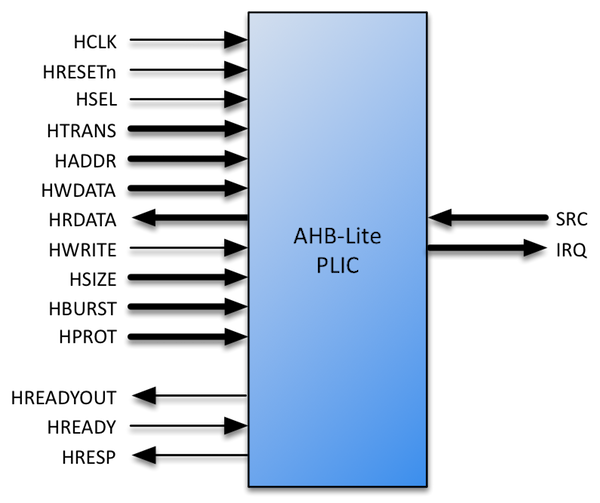

# AHB-Lite PLIC Datasheet

The Roa Logic AHB-Lite PLIC (Platform Level Interrupt Controller) IP is a fully parameterized soft IP implementing a Interrupt Controller as specified by the RISC-V Privileged 1.9.1 specification.

The IP features an AHB-Lite Slave interface, with all signals defined in the *AMBA 3 AHB-Lite v1.0* specifications fully supported. Bus address & data widths as well as the number of Interrupt Sources and Targets supported are specified via parameters.

The controller further supports user defined priority levels and pending events, in addition to interrupt masking via programmable priority thresholds

## Features

- AHB-Lite Interface with programmable address and data width
- User defined number of Interrupt Sources & Targets
- User defined priority level per Interrupt Source
- Interrupt masking per target via Priority Threshold support
- User defined Interrupt Pending queue depth per source

# Contents

[Getting Started](./AHB-Lite_PLIC_GettingStarted.md)

[Specifications](./AHB-Lite_PLIC_Datasheet.md#Resources)

[Configurations](./AHB-Lite_PLIC_GettingStarted.md)

[Interfaces](./AHB-Lite_PLIC_GettingStarted.md)

[Resources](./AHB-Lite_PLIC_GettingStarted.md)

# Revision History

 

| **Date** | **Rev.** | **Comments** |
| -------- | -------- | ------------ |
|          | 1.0      |              |
|          |          |              |
|          |          |              |
|          |          |              |
